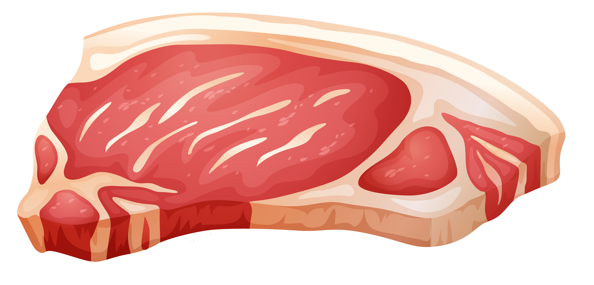

Copyright (c) 2001-2021 Ricky.

## Index
1. **[Abstraction](#meatloaf)**
2. **[Functionality](#functionality)**
3. **[Execution](#execution)**

# Abstraction
In extension to majority of main-stream middle level languages, this is an attempt to make high level abstractions to often ignored core backbone language implementation details. Concepts such as **keywords** and **qualifiers** are some of the few barebone level ideas that exists only behind the scene. In most cases, the idea of a user-creatable keyword, type qualifier or an operator is impossible and taboo.. Let's change that.

In analysis, *everything* consisted of source code is but abstract concepts that all boil down to the idea of meaning in  characters a with definable behavior (where behind the scenes an analogue to speaking with the CPU). Meatloaf intends to abstract every fundamental language implementation into a high level arena, user-definable, overridable.. This introduces beautifully the linguistic concepts like *Morphemes*, various types of *Affix*-es instead of traditional *keywords* and *operators*.

In theory, opening up language implementaion onto a higher level opens up syntax immitation, Meatloaf code but in Python syntax as an example. On the surface, it sounds rather useless, but there's something to be said about the capability of understanding different syntax implementation on a high level.

###### TBC